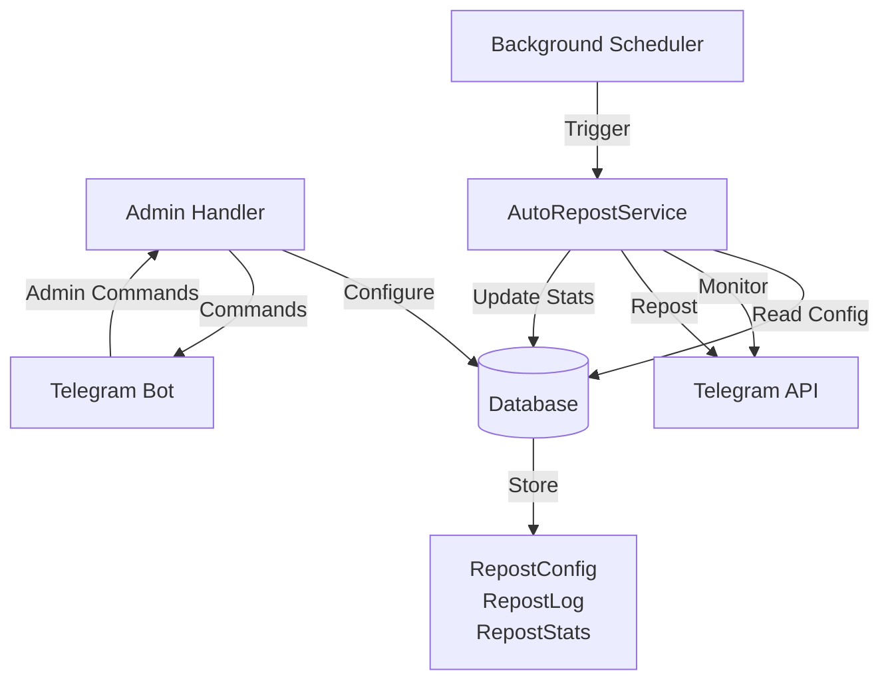

# Design Document: Auto Repost System

## Overview

The Auto Repost System is a background service that monitors Telegram channels for new content and automatically reposts it to configured target channels. The system integrates with the existing Telegram bot infrastructure, using aiogram 3.x for Telegram API interactions and SQLAlchemy for data persistence.

The design follows the existing codebase patterns with a service-based architecture, where the `AutoRepostService` handles the core monitoring and reposting logic, while new database models track configuration and statistics. The system operates as a continuous background task that checks source channels at configurable intervals.

Key design decisions:
- **Copy vs Forward**: Support both forwarding (with attribution) and copying (without attribution) to give admins flexibility
- **Incremental Processing**: Track the last processed message ID per source channel to avoid reprocessing
- **Error Resilience**: Continue monitoring other channels even when one fails
- **Configurable Intervals**: Allow per-source-channel monitoring intervals (default 2 minutes)
- **Content Filtering**: Support filtering by media type (text, photo, video, etc.)

## Architecture

### System Components



### Component Responsibilities

1. **AutoRepostService**: Core service that monitors source channels and performs reposting
   - Checks source channels for new messages
   - Applies content filters
   - Handles reposting with watermarks and delays
   - Tracks statistics and errors

2. **RepostConfig Model**: Stores configuration for each source channel
   - Source channel ID and target channel ID
   - Monitoring interval and last processed message ID
   - Content filters and watermark settings
   - Enable/disable status

3. **RepostLog Model**: Records each repost operation
   - Source and target message IDs
   - Timestamp and status (success/failure)
   - Error messages if applicable

4. **RepostStats Model**: Aggregates statistics per source channel
   - Total reposts, successful and failed counts
   - Last repost timestamp
   - Content type breakdown

5. **Admin Handler Extensions**: New commands for managing auto-repost
   - `/autorepost add` - Add source channel
   - `/autorepost list` - List configured sources
   - `/autorepost config` - Configure source settings
   - `/autorepost stats` - View statistics
   - `/autorepost enable/disable` - Toggle monitoring

6. **Background Scheduler**: Manages periodic execution
   - Runs AutoRepostService at configured intervals
   - Handles service lifecycle (start/stop/restart)

## Components and Interfaces

### Database Models

#### RepostConfig Model

```python
class RepostConfig(Base, TimestampMixin):
    """Configuration for auto-reposting from a source channel"""
    
    id: int  # Primary key
    source_channel_id: int  # Source channel to monitor
    source_channel_title: str  # Display name
    target_channel_id: int  # Where to repost
    target_channel_title: str  # Display name
    
    # Monitoring settings
    is_enabled: bool  # Enable/disable monitoring
    check_interval_seconds: int  # How often to check (default 120)
    last_processed_message_id: int  # Track progress
    start_from_oldest: bool  # Start from beginning or latest
    
    # Repost settings
    remove_forward_attribution: bool  # Copy vs forward
    watermark_text: Optional[str]  # Optional caption to add
    repost_delay_seconds: int  # Delay between reposts (default 0)
    
    # Content filtering
    allowed_content_types: List[str]  # ['text', 'photo', 'video', etc.]
    
    # Status tracking
    status: str  # 'active', 'error', 'disabled'
    last_error: Optional[str]  # Last error message
    last_check_at: Optional[datetime]  # Last monitoring attempt
```

#### RepostLog Model

```python
class RepostLog(Base, TimestampMixin):
    """Log of individual repost operations"""
    
    id: int  # Primary key
    config_id: int  # Foreign key to RepostConfig
    
    source_message_id: int
    target_message_id: Optional[int]  # Null if failed
    
    content_type: str  # 'text', 'photo', 'video', etc.
    status: str  # 'success', 'failed', 'filtered'
    error_message: Optional[str]
    
    reposted_at: datetime
```

#### RepostStats Model

```python
class RepostStats(Base, TimestampMixin):
    """Aggregated statistics per source channel"""
    
    id: int  # Primary key
    config_id: int  # Foreign key to RepostConfig
    
    total_reposts: int
    successful_reposts: int
    failed_reposts: int
    filtered_posts: int
    
    # Content type breakdown (JSON)
    content_type_counts: dict  # {'photo': 10, 'video': 5, ...}
    
    last_repost_at: Optional[datetime]
    stats_period_start: datetime  # For time-based stats
```

### Service Interface

#### AutoRepostService

```python
class AutoRepostService:
    """Service for monitoring and reposting channel content"""
    
    def __init__(self, bot: Bot, session: AsyncSession):
        self.bot = bot
        self.session = session
    
    async def monitor_all_sources(self) -> None:
        """Check all enabled source channels for new content"""
        # Get all enabled configs
        # For each config, call monitor_source()
    
    async def monitor_source(self, config: RepostConfig) -> None:
        """Monitor a single source channel"""
        # Get new messages since last_processed_message_id
        # Filter by content type
        # Repost each message
        # Update last_processed_message_id
    
    async def repost_message(
        self, 
        config: RepostConfig, 
        message: Message
    ) -> bool:
        """Repost a single message to target channel"""
        # Apply watermark if configured
        # Copy or forward based on remove_forward_attribution
        # Apply delay if configured
        # Log result
        # Update statistics
        # Return success/failure
    
    async def get_new_messages(
        self, 
        config: RepostConfig
    ) -> List[Message]:
        """Fetch new messages from source channel"""
        # Use bot.get_chat_history() or similar
        # Filter by message_id > last_processed_message_id
        # Return list of messages
    
    async def apply_content_filter(
        self, 
        message: Message, 
        allowed_types: List[str]
    ) -> bool:
        """Check if message matches content filter"""
        # Determine message content type
        # Return True if allowed, False otherwise
    
    async def copy_message_with_watermark(
        self,
        message: Message,
        target_channel_id: int,
        watermark: Optional[str]
    ) -> Message:
        """Copy message to target with optional watermark"""
        # Handle different message types (text, photo, video, etc.)
        # Append watermark to caption/text
        # Return sent message
    
    async def update_statistics(
        self,
        config: RepostConfig,
        status: str,
        content_type: str
    ) -> None:
        """Update repost statistics"""
        # Increment counters
        # Update last_repost_at
        # Commit to database
```

### Admin Handler Extensions

```python
class AdminHandler:
    """Extended with auto-repost commands"""
    
    async def handle_autorepost_add(self, message: Message) -> None:
        """Add a new source channel to monitor"""
        # Parse channel identifier (username or ID)
        # Validate bot has access
        # Create RepostConfig with defaults
        # Ask for target channel
    
    async def handle_autorepost_list(self, message: Message) -> None:
        """List all configured source channels"""
        # Query all RepostConfig records
        # Display with status and basic stats
    
    async def handle_autorepost_config(self, message: Message) -> None:
        """Configure settings for a source channel"""
        # Show inline keyboard with options:
        # - Set target channel
        # - Set monitoring interval
        # - Configure watermark
        # - Set content filters
        # - Set repost delay
        # - Toggle forward attribution
    
    async def handle_autorepost_stats(self, message: Message) -> None:
        """View repost statistics"""
        # Query RepostStats
        # Display formatted statistics
    
    async def handle_autorepost_enable(self, message: Message) -> None:
        """Enable monitoring for a source channel"""
        # Update is_enabled = True
    
    async def handle_autorepost_disable(self, message: Message) -> None:
        """Disable monitoring for a source channel"""
        # Update is_enabled = False
    
    async def handle_autorepost_remove(self, message: Message) -> None:
        """Remove a source channel from monitoring"""
        # Delete RepostConfig (preserve logs and stats)
```

## Data Models

### RepostConfig Schema

```sql
CREATE TABLE repost_configs (
    id INTEGER PRIMARY KEY,
    source_channel_id BIGINT NOT NULL,
    source_channel_title VARCHAR(255) NOT NULL,
    target_channel_id BIGINT NOT NULL,
    target_channel_title VARCHAR(255) NOT NULL,
    
    is_enabled BOOLEAN DEFAULT TRUE,
    check_interval_seconds INTEGER DEFAULT 120,
    last_processed_message_id INTEGER DEFAULT 0,
    start_from_oldest BOOLEAN DEFAULT FALSE,
    
    remove_forward_attribution BOOLEAN DEFAULT TRUE,
    watermark_text TEXT,
    repost_delay_seconds INTEGER DEFAULT 0,
    
    allowed_content_types JSON,  -- ['text', 'photo', 'video', ...]
    
    status VARCHAR(20) DEFAULT 'active',
    last_error TEXT,
    last_check_at TIMESTAMP,
    
    created_at TIMESTAMP DEFAULT CURRENT_TIMESTAMP,
    updated_at TIMESTAMP DEFAULT CURRENT_TIMESTAMP,
    
    UNIQUE(source_channel_id)
);
```

### RepostLog Schema

```sql
CREATE TABLE repost_logs (
    id INTEGER PRIMARY KEY,
    config_id INTEGER NOT NULL,
    
    source_message_id INTEGER NOT NULL,
    target_message_id INTEGER,
    
    content_type VARCHAR(50) NOT NULL,
    status VARCHAR(20) NOT NULL,
    error_message TEXT,
    
    reposted_at TIMESTAMP DEFAULT CURRENT_TIMESTAMP,
    created_at TIMESTAMP DEFAULT CURRENT_TIMESTAMP,
    updated_at TIMESTAMP DEFAULT CURRENT_TIMESTAMP,
    
    FOREIGN KEY (config_id) REFERENCES repost_configs(id) ON DELETE CASCADE
);
```

### RepostStats Schema

```sql
CREATE TABLE repost_stats (
    id INTEGER PRIMARY KEY,
    config_id INTEGER NOT NULL UNIQUE,
    
    total_reposts INTEGER DEFAULT 0,
    successful_reposts INTEGER DEFAULT 0,
    failed_reposts INTEGER DEFAULT 0,
    filtered_posts INTEGER DEFAULT 0,
    
    content_type_counts JSON,  -- {'photo': 10, 'video': 5}
    
    last_repost_at TIMESTAMP,
    stats_period_start TIMESTAMP DEFAULT CURRENT_TIMESTAMP,
    
    created_at TIMESTAMP DEFAULT CURRENT_TIMESTAMP,
    updated_at TIMESTAMP DEFAULT CURRENT_TIMESTAMP,
    
    FOREIGN KEY (config_id) REFERENCES repost_configs(id) ON DELETE CASCADE
);
```

### Content Type Enumeration

Supported content types for filtering:
- `text` - Text-only messages
- `photo` - Photos/images
- `video` - Video files
- `document` - Documents/files
- `audio` - Audio files
- `voice` - Voice messages
- `animation` - GIFs/animations
- `sticker` - Stickers
- `poll` - Polls
- `location` - Location shares

## Correctness Properties

*A property is a characteristic or behavior that should hold true across all valid executions of a system—essentially, a formal statement about what the system should do. Properties serve as the bridge between human-readable specifications and machine-verifiable correctness guarantees.*


### Property 1: Channel Addition and Persistence

*For any* valid channel identifier (username or ID), when an admin adds it as a source channel, the channel should appear in the configured sources list and persist in the database across bot restarts.

**Validates: Requirements 1.1, 1.4, 9.1, 9.3**

### Property 2: Invalid Channel Rejection

*For any* invalid or inaccessible channel identifier, attempting to add it as a source channel should return an error and not create a database record.

**Validates: Requirements 1.2, 1.5**

### Property 3: Channel Removal Preserves History

*For any* source channel with existing repost logs, removing the channel configuration should delete the config but preserve all historical repost logs and statistics.

**Validates: Requirements 1.3**

### Property 4: No Duplicate Processing

*For any* source channel, after processing a message with ID N, the system should update last_processed_message_id to N and never repost that message again, even across multiple monitoring cycles.

**Validates: Requirements 2.3**

### Property 5: Error Isolation

*For any* set of source channels where one channel becomes inaccessible, the monitoring service should continue processing all other accessible channels without interruption.

**Validates: Requirements 2.4, 8.5**

### Property 6: New Message Detection

*For any* source channel with messages, when new messages are posted after the last_processed_message_id, the monitoring service should identify all new messages as candidates for reposting.

**Validates: Requirements 2.2**

### Property 7: Content Type Preservation

*For any* message being reposted, the content type (text, photo, video, document, etc.) of the reposted message should match the content type of the original message.

**Validates: Requirements 3.5**

### Property 8: Watermark Application

*For any* repost configuration with a watermark set, all reposted messages should contain the watermark text appended to the caption or message text.

**Validates: Requirements 3.2, 4.2**

### Property 9: Forward Attribution Control

*For any* repost configuration with remove_forward_attribution set to true, reposted messages should be copies without the "Forwarded from" header; when set to false, messages should be forwarded with attribution.

**Validates: Requirements 3.6, 4.6**

### Property 10: Content Type Filtering

*For any* repost configuration with content type filters specified, only messages matching at least one of the allowed content types should be reposted, and all other messages should be marked as filtered in the logs.

**Validates: Requirements 4.4, 5.1, 5.2**

### Property 11: Default Filter Behavior

*For any* repost configuration with no content type filters specified (empty or null), all message types should pass the filter and be eligible for reposting.

**Validates: Requirements 5.4**

### Property 12: Delay Validation

*For any* repost delay value, the system should accept values between 1 and 3600 seconds inclusive, and reject values outside this range with a validation error.

**Validates: Requirements 4.3**

### Property 13: Independent Configuration

*For any* two different source channels with different configurations (watermarks, filters, delays), operations on one channel should not affect the configuration or behavior of the other channel.

**Validates: Requirements 4.5**

### Property 14: Enable/Disable State Preservation

*For any* source channel, disabling then re-enabling the channel should preserve all configuration settings (watermark, filters, target channel, etc.) unchanged.

**Validates: Requirements 6.1, 6.2, 6.3, 6.4**

### Property 15: Statistics Accuracy

*For any* sequence of repost operations (successful, failed, or filtered), the statistics counters (total_reposts, successful_reposts, failed_reposts, filtered_posts) should accurately reflect the count of each operation type.

**Validates: Requirements 7.1, 7.3, 7.4**

### Property 16: Statistics Filtering

*For any* specific source channel, requesting statistics for that channel should return only metrics related to that channel and not include data from other source channels.

**Validates: Requirements 7.5**

### Property 17: Error Status Updates

*For any* source channel that becomes inaccessible during monitoring, the system should update the channel's status to "error" and record the error message in the last_error field.

**Validates: Requirements 8.1**

### Property 18: Configuration Atomicity

*For any* configuration update operation, either all fields should be updated successfully in the database, or none should be updated (atomic transaction).

**Validates: Requirements 9.2**

### Property 19: Referential Integrity

*For any* repost log or statistics record, the config_id foreign key should always reference an existing repost configuration, and deleting a configuration should cascade delete its logs and stats.

**Validates: Requirements 9.5**

### Property 20: Admin Authorization

*For any* auto-repost admin command, the system should verify the user is in the admin list before executing the command, and reject non-admin users with an error message.

**Validates: Requirements 10.2**

## Error Handling

### Error Categories

1. **Channel Access Errors**
   - Source channel not found or bot removed
   - Target channel not found or bot removed
   - Insufficient permissions to read/write
   - **Handling**: Mark channel status as "error", log error message, continue monitoring other channels

2. **Network Errors**
   - Telegram API timeout
   - Connection failures
   - Rate limiting
   - **Handling**: Retry up to 3 times with exponential backoff (1s, 2s, 4s), log if all retries fail

3. **Content Errors**
   - Message deleted before reposting
   - Unsupported media type
   - File too large
   - **Handling**: Log as failed repost, increment failed counter, continue with next message

4. **Configuration Errors**
   - Invalid channel ID format
   - Invalid delay value
   - Missing required fields
   - **Handling**: Return validation error to admin, do not save configuration

5. **Database Errors**
   - Connection failures
   - Constraint violations
   - Transaction deadlocks
   - **Handling**: Rollback transaction, log error, retry operation once, notify admin if persistent

### Error Recovery Strategies

1. **Automatic Recovery**
   - Network errors: Retry with backoff
   - Transient API errors: Retry next monitoring cycle
   - Rate limits: Wait and retry

2. **Manual Recovery**
   - Channel access revoked: Admin must re-authorize bot
   - Configuration errors: Admin must fix configuration
   - Persistent database errors: Admin must investigate

3. **Graceful Degradation**
   - If one source fails, continue monitoring others
   - If target channel fails, pause that config but continue others
   - If database read fails, use cached configuration

### Error Notifications

Admins receive notifications for:
- Channel access errors (immediate)
- Persistent failures (after 3 consecutive failures)
- Configuration validation errors (immediate)
- Critical system errors (immediate)

Notification format:
```
⚠️ Auto-Repost Error

Source: [Channel Name]
Error: [Error Message]
Time: [Timestamp]
Action: [Suggested Action]
```

## Testing Strategy

### Dual Testing Approach

The auto-repost system requires both unit tests and property-based tests for comprehensive coverage:

**Unit Tests** focus on:
- Specific examples of message reposting (text, photo, video)
- Edge cases (empty watermarks, zero delay, single content type)
- Error conditions (inaccessible channels, network failures)
- Integration points (database transactions, Telegram API calls)
- Admin command parsing and validation

**Property-Based Tests** focus on:
- Universal properties across all inputs (see Correctness Properties above)
- Comprehensive input coverage through randomization
- Invariants that must hold regardless of configuration

### Property-Based Testing Configuration

**Library**: Use `hypothesis` for Python property-based testing

**Configuration**:
- Minimum 100 iterations per property test
- Each test tagged with: `# Feature: auto-repost-system, Property N: [property text]`
- Custom generators for:
  - Channel IDs (valid Telegram format)
  - Message objects with various content types
  - Configuration objects with valid ranges
  - Watermark text (various lengths and characters)

**Example Property Test Structure**:
```python
from hypothesis import given, strategies as st
import pytest

@given(
    channel_id=st.integers(min_value=-1000000000000, max_value=-1),
    watermark=st.text(min_size=0, max_size=200)
)
@pytest.mark.property_test
def test_watermark_application(channel_id, watermark):
    """
    Feature: auto-repost-system, Property 8: Watermark Application
    
    For any repost configuration with a watermark set, all reposted 
    messages should contain the watermark text.
    """
    # Test implementation
    pass
```

### Test Coverage Goals

- **Unit Tests**: 80%+ code coverage
- **Property Tests**: All 20 correctness properties implemented
- **Integration Tests**: End-to-end repost flow for each content type
- **Error Tests**: All error categories and recovery strategies

### Testing Priorities

1. **Critical Path**: Message detection and reposting (Properties 4, 6, 7)
2. **Data Integrity**: No duplicate processing, statistics accuracy (Properties 4, 15, 19)
3. **Error Handling**: Error isolation, status updates (Properties 5, 17)
4. **Configuration**: Filtering, watermarks, enable/disable (Properties 10, 8, 14)
5. **Security**: Admin authorization (Property 20)

### Mock Strategy

Mock external dependencies:
- Telegram Bot API (use aiogram test utilities)
- Database (use in-memory SQLite for tests)
- Time/delays (use fake timers)

Do not mock:
- Core business logic (filtering, watermark application)
- Data models and validation
- Configuration parsing

### Continuous Testing

- Run unit tests on every commit
- Run property tests nightly (due to longer execution time)
- Run integration tests before deployment
- Monitor test execution time and optimize slow tests
