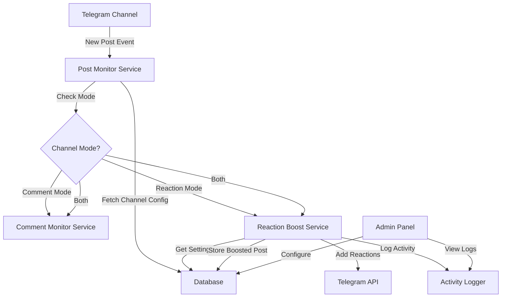

# Design Document: Reaction Boost System

## Overview

The Reaction Boost System extends the Telegram bot's capabilities by adding a second operational mode alongside the existing comment response functionality. This design introduces a flexible channel mode system that allows administrators to configure channels for comment responses, reaction boosting, or both simultaneously.

The system automatically detects new posts in configured channels and adds reactions according to admin-defined settings. The design emphasizes natural-looking behavior through randomization and delays, robust error handling for Telegram API limitations, and comprehensive logging for monitoring and troubleshooting.

### Key Design Goals

- **Dual-mode operation**: Support both comment response and reaction boost modes independently or simultaneously
- **Natural appearance**: Randomize emoji order and add configurable delays between reactions
- **Resilience**: Handle rate limits, permission errors, and API failures gracefully
- **Backward compatibility**: Existing channel configurations continue working without modification
- **Observability**: Comprehensive logging and admin panel visibility into boost activities

## Architecture

### High-Level Architecture



### Component Interaction Flow

1. **Post Detection**: Post Monitor Service polls Telegram API for new posts in configured channels
2. **Mode Routing**: Based on channel configuration, route to appropriate service(s)
3. **Reaction Boosting**: Reaction Boost Service retrieves settings, adds reactions with delays, logs activity
4. **Deduplication**: Check BoostedPost records to avoid duplicate boosting
5. **Error Handling**: Catch and log API errors, handle rate limits with exponential backoff

## Components and Interfaces

### 1. Database Models

#### Channel Model (Extended)

```python
class Channel(Base):
    __tablename__ = 'channels'
    
    id: int  # Primary key
    channel_id: str  # Telegram channel ID
    discussion_group_id: str | None  # For comment mode
    mode: str  # 'comment', 'reaction', 'both'
    reaction_settings: dict | None  # JSON field
    is_active: bool
    created_at: datetime
    updated_at: datetime
    
    # Relationships
    boosted_posts: list[BoostedPost]
```

**Reaction Settings Schema:**
```python
{
    "emojis": ["👍", "❤️", "🔥", "😍"],  # List of emoji strings
    "reaction_count": 5,  # Number of reactions per post
    "delay_min": 2,  # Minimum delay in seconds
    "delay_max": 8,  # Maximum delay in seconds
    "auto_boost": true  # Enable/disable auto-boosting
}
```

#### BoostedPost Model (New)

```python
class BoostedPost(Base):
    __tablename__ = 'boosted_posts'
    
    id: int  # Primary key
    channel_id: int  # Foreign key to Channel
    post_id: int  # Telegram message ID
    boost_timestamp: datetime
    reaction_count: int
    emojis_used: list[str]  # JSON array
    
    # Indexes
    __table_args__ = (
        Index('idx_channel_post', 'channel_id', 'post_id', unique=True),
    )
```

#### ActivityLog Model (New)

```python
class ActivityLog(Base):
    __tablename__ = 'activity_logs'
    
    id: int  # Primary key
    channel_id: int  # Foreign key to Channel
    post_id: int | None
    activity_type: str  # 'reaction_added', 'boost_completed', 'error'
    details: dict  # JSON field with activity-specific data
    timestamp: datetime
    
    # Indexes
    __table_args__ = (
        Index('idx_channel_timestamp', 'channel_id', 'timestamp'),
    )
```

### 2. Post Monitor Service

**Responsibility**: Detect new posts in configured channels and route to appropriate services.

```python
class PostMonitorService:
    def __init__(self, bot: Bot, db_session: AsyncSession):
        self.bot = bot
        self.db = db_session
        self.last_checked: dict[str, int] = {}  # channel_id -> last_message_id
    
    async def monitor_channels(self) -> None:
        """Main monitoring loop - polls channels for new posts"""
        channels = await self._get_active_channels()
        
        for channel in channels:
            try:
                new_posts = await self._fetch_new_posts(channel)
                
                for post in new_posts:
                    if 'reaction' in channel.mode:
                        await self.reaction_service.boost_post(channel, post)
                    if 'comment' in channel.mode:
                        await self.comment_service.monitor_comments(channel, post)
                        
            except Exception as e:
                await self._log_error(channel, e)
    
    async def _fetch_new_posts(self, channel: Channel) -> list[Message]:
        """Fetch posts newer than last checked message ID"""
        pass
    
    async def _get_active_channels(self) -> list[Channel]:
        """Query database for active channels"""
        pass
```

### 3. Reaction Boost Service

**Responsibility**: Add reactions to posts according to channel configuration.

```python
class ReactionBoostService:
    def __init__(self, bot: Bot, db_session: AsyncSession):
        self.bot = bot
        self.db = db_session
        self.logger = ActivityLogger(db_session)
        self.max_retries = 3
    
    async def boost_post(self, channel: Channel, post: Message) -> None:
        """Main entry point for boosting a post"""
        # Check if already boosted
        if await self._is_already_boosted(channel.id, post.message_id):
            return
        
        # Validate settings
        settings = self._parse_reaction_settings(channel.reaction_settings)
        if not settings or not settings.auto_boost:
            return
        
        # Add reactions
        reactions_added = 0
        emojis = self._select_random_emojis(settings)
        
        for emoji in emojis:
            try:
                await self._add_reaction_with_retry(channel.channel_id, post.message_id, emoji)
                reactions_added += 1
                await self.logger.log_reaction_added(channel.id, post.message_id, emoji)
                
                # Random delay before next reaction
                delay = random.uniform(settings.delay_min, settings.delay_max)
                await asyncio.sleep(delay)
                
            except TelegramAPIError as e:
                await self._handle_api_error(channel, post, emoji, e)
        
        # Mark as boosted
        await self._mark_as_boosted(channel.id, post.message_id, reactions_added, emojis)
        await self.logger.log_boost_completed(channel.id, post.message_id, reactions_added)
    
    async def _add_reaction_with_retry(self, channel_id: str, message_id: int, emoji: str) -> None:
        """Add reaction with exponential backoff retry"""
        for attempt in range(self.max_retries):
            try:
                await self.bot.set_message_reaction(
                    chat_id=channel_id,
                    message_id=message_id,
                    reaction=[ReactionTypeEmoji(emoji=emoji)]
                )
                return
            except FloodWait as e:
                if attempt < self.max_retries - 1:
                    await asyncio.sleep(e.retry_after)
                else:
                    raise
    
    def _select_random_emojis(self, settings: ReactionSettings) -> list[str]:
        """Select and shuffle emojis for natural appearance"""
        emojis = settings.emojis.copy()
        random.shuffle(emojis)
        return emojis[:settings.reaction_count]
    
    async def _is_already_boosted(self, channel_id: int, post_id: int) -> bool:
        """Check if post has already been boosted"""
        result = await self.db.execute(
            select(BoostedPost).where(
                BoostedPost.channel_id == channel_id,
                BoostedPost.post_id == post_id
            )
        )
        return result.scalar_one_or_none() is not None
    
    async def _mark_as_boosted(self, channel_id: int, post_id: int, 
                               reaction_count: int, emojis: list[str]) -> None:
        """Record boosted post in database"""
        boosted_post = BoostedPost(
            channel_id=channel_id,
            post_id=post_id,
            boost_timestamp=datetime.utcnow(),
            reaction_count=reaction_count,
            emojis_used=emojis
        )
        self.db.add(boosted_post)
        await self.db.commit()
    
    async def _handle_api_error(self, channel: Channel, post: Message, 
                                emoji: str, error: Exception) -> None:
        """Handle Telegram API errors"""
        if isinstance(error, ChatAdminRequired):
            await self.logger.log_error(
                channel.id, post.message_id,
                'permission_error',
                {'message': 'Bot is not admin in channel'}
            )
            # Disable reaction mode for this channel
            await self._disable_reaction_mode(channel)
        elif isinstance(error, FloodWait):
            await self.logger.log_error(
                channel.id, post.message_id,
                'rate_limit',
                {'retry_after': error.retry_after}
            )
        else:
            await self.logger.log_error(
                channel.id, post.message_id,
                'unknown_error',
                {'error': str(error), 'emoji': emoji}
            )
```

### 4. Activity Logger

**Responsibility**: Log all reaction boost activities for monitoring and debugging.

```python
class ActivityLogger:
    def __init__(self, db_session: AsyncSession):
        self.db = db_session
    
    async def log_reaction_added(self, channel_id: int, post_id: int, emoji: str) -> None:
        """Log individual reaction addition"""
        log = ActivityLog(
            channel_id=channel_id,
            post_id=post_id,
            activity_type='reaction_added',
            details={'emoji': emoji},
            timestamp=datetime.utcnow()
        )
        self.db.add(log)
        await self.db.commit()
    
    async def log_boost_completed(self, channel_id: int, post_id: int, 
                                  reaction_count: int) -> None:
        """Log completion of post boosting"""
        log = ActivityLog(
            channel_id=channel_id,
            post_id=post_id,
            activity_type='boost_completed',
            details={'reaction_count': reaction_count},
            timestamp=datetime.utcnow()
        )
        self.db.add(log)
        await self.db.commit()
    
    async def log_error(self, channel_id: int, post_id: int | None,
                       error_type: str, details: dict) -> None:
        """Log errors during boosting"""
        log = ActivityLog(
            channel_id=channel_id,
            post_id=post_id,
            activity_type='error',
            details={'error_type': error_type, **details},
            timestamp=datetime.utcnow()
        )
        self.db.add(log)
        await self.db.commit()
```

### 5. Admin Panel Handler (Extended)

**Responsibility**: Handle admin panel interactions for channel configuration.

```python
class AdminHandler:
    async def create_channel_config(self, update: Update, context: CallbackContext) -> None:
        """Handle channel creation with mode selection"""
        # Show mode selection keyboard
        keyboard = [
            [InlineKeyboardButton("Comment Response", callback_data="mode_comment")],
            [InlineKeyboardButton("Reaction Boost", callback_data="mode_reaction")],
            [InlineKeyboardButton("Both Modes", callback_data="mode_both")]
        ]
        await update.message.reply_text(
            "Select channel mode:",
            reply_markup=InlineKeyboardMarkup(keyboard)
        )
    
    async def configure_reaction_settings(self, update: Update, context: CallbackContext) -> None:
        """Handle reaction settings configuration"""
        # Multi-step conversation to collect:
        # - Emoji list
        # - Reaction count
        # - Delay range
        # - Auto-boost toggle
        pass
    
    async def validate_bot_permissions(self, channel_id: str) -> dict:
        """Check if bot has admin permissions in channel"""
        try:
            member = await self.bot.get_chat_member(channel_id, self.bot.id)
            return {
                'is_admin': member.status in ['administrator', 'creator'],
                'can_post_messages': member.can_post_messages,
                'status': member.status
            }
        except Exception as e:
            return {'is_admin': False, 'error': str(e)}
    
    async def display_activity_logs(self, channel_id: int, limit: int = 50) -> str:
        """Fetch and format recent activity logs"""
        logs = await self.db.execute(
            select(ActivityLog)
            .where(ActivityLog.channel_id == channel_id)
            .order_by(ActivityLog.timestamp.desc())
            .limit(limit)
        )
        
        # Format logs for display
        return self._format_logs(logs.scalars().all())
```

## Data Models

### Channel Mode Enumeration

```python
class ChannelMode(str, Enum):
    COMMENT = "comment"
    REACTION = "reaction"
    BOTH = "both"
```

### Reaction Settings Data Class

```python
@dataclass
class ReactionSettings:
    emojis: list[str]
    reaction_count: int
    delay_min: float
    delay_max: float
    auto_boost: bool
    
    def validate(self) -> tuple[bool, str | None]:
        """Validate settings"""
        if not self.emojis:
            return False, "At least one emoji must be selected"
        if not (1 <= self.reaction_count <= 100):
            return False, "Reaction count must be between 1 and 100"
        if self.delay_min < 0 or self.delay_max < self.delay_min:
            return False, "Invalid delay range"
        if self.reaction_count > len(self.emojis):
            return False, "Reaction count cannot exceed number of emojis"
        return True, None
```

### Database Migration

```python
# Alembic migration for schema updates
def upgrade():
    # Add mode column to channels table
    op.add_column('channels', sa.Column('mode', sa.String(20), nullable=False, server_default='comment'))
    
    # Add reaction_settings column
    op.add_column('channels', sa.Column('reaction_settings', sa.JSON(), nullable=True))
    
    # Create boosted_posts table
    op.create_table(
        'boosted_posts',
        sa.Column('id', sa.Integer(), primary_key=True),
        sa.Column('channel_id', sa.Integer(), sa.ForeignKey('channels.id'), nullable=False),
        sa.Column('post_id', sa.Integer(), nullable=False),
        sa.Column('boost_timestamp', sa.DateTime(), nullable=False),
        sa.Column('reaction_count', sa.Integer(), nullable=False),
        sa.Column('emojis_used', sa.JSON(), nullable=False)
    )
    
    # Create indexes
    op.create_index('idx_channel_post', 'boosted_posts', ['channel_id', 'post_id'], unique=True)
    
    # Create activity_logs table
    op.create_table(
        'activity_logs',
        sa.Column('id', sa.Integer(), primary_key=True),
        sa.Column('channel_id', sa.Integer(), sa.ForeignKey('channels.id'), nullable=False),
        sa.Column('post_id', sa.Integer(), nullable=True),
        sa.Column('activity_type', sa.String(50), nullable=False),
        sa.Column('details', sa.JSON(), nullable=False),
        sa.Column('timestamp', sa.DateTime(), nullable=False)
    )
    
    # Create indexes
    op.create_index('idx_channel_timestamp', 'activity_logs', ['channel_id', 'timestamp'])
```

