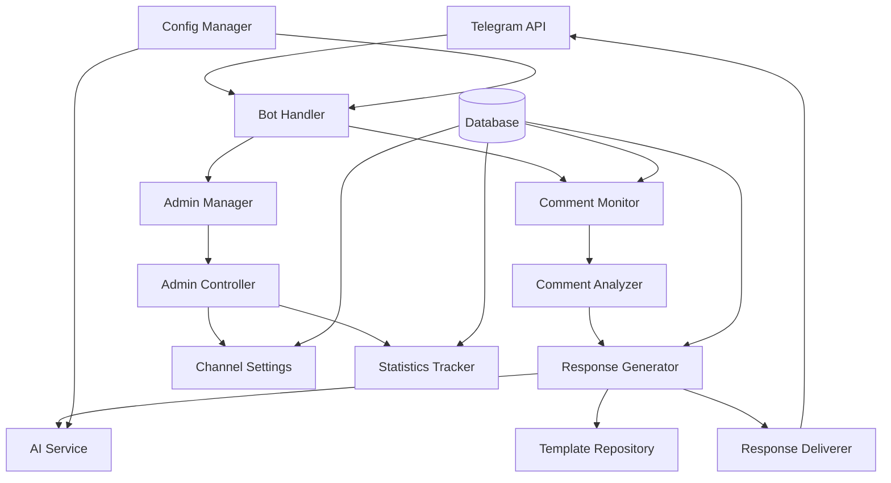

# Design Document: Telegram AI Bot

## Overview

The Telegram AI Bot is an intelligent automated response system designed for business channels. The bot monitors discussion groups linked to Telegram channels and provides contextual, sales-oriented responses to user comments. The system uses AI integration for dynamic response generation while maintaining anti-spam measures and administrative controls.

## Architecture

The system follows a modular, event-driven architecture with the following key components:



### Core Architecture Principles

1. **Event-Driven Processing**: All comment processing is triggered by Telegram webhook events
2. **Modular Design**: Each component has a single responsibility and clear interfaces
3. **Asynchronous Operations**: All I/O operations are non-blocking using asyncio
4. **Configurable AI Integration**: Support for multiple AI providers with fallback mechanisms
5. **Multi-Channel Support**: Single bot instance can manage multiple channels simultaneously

## Components and Interfaces

### 1. Bot Handler (`BotHandler`)

**Responsibility**: Main entry point for all Telegram interactions

**Interface**:
```python
class BotHandler:
    async def start_bot() -> None
    async def stop_bot() -> None
    async def handle_message(update: Update) -> None
    async def handle_admin_command(update: Update) -> None
```

**Key Functions**:
- Initialize bot connection with Telegram API
- Route incoming messages to appropriate handlers
- Manage bot lifecycle and error recovery

### 2. Comment Monitor (`CommentMonitor`)

**Responsibility**: Track and process discussion group messages

**Interface**:
```python
class CommentMonitor:
    async def process_comment(message: Message) -> None
    async def is_valid_comment(message: Message) -> bool
    async def check_spam_protection(user_id: int, channel_id: int) -> bool
```

**Key Functions**:
- Filter relevant comments from discussion groups
- Apply spam protection and rate limiting
- Store comment metadata in database

### 3. Comment Analyzer (`CommentAnalyzer`)

**Responsibility**: Categorize and analyze comment content

**Interface**:
```python
class CommentAnalyzer:
    async def categorize_comment(text: str) -> CommentCategory
    async def extract_keywords(text: str) -> List[str]
    async def should_respond(comment: Comment, settings: ChannelSettings) -> bool
```

**Key Functions**:
- Classify comments into categories (price, location, contact, order, general)
- Extract trigger words and intent
- Determine response necessity based on channel settings

### 4. Response Generator (`ResponseGenerator`)

**Responsibility**: Create appropriate responses using templates or AI

**Interface**:
```python
class ResponseGenerator:
    async def generate_response(comment: Comment, category: CommentCategory) -> str
    async def get_template_response(category: CommentCategory, channel_id: int) -> Optional[str]
    async def generate_ai_response(comment: Comment, channel_settings: ChannelSettings) -> str
```

**Key Functions**:
- Check for predefined template responses
- Generate AI responses when templates unavailable
- Apply response formatting and length limits

### 5. AI Service (`AIService`)

**Responsibility**: Interface with external AI providers

**Interface**:
```python
class AIService:
    async def generate_response(prompt: str, context: str) -> str
    async def health_check() -> bool
    async def switch_provider(provider: AIProvider) -> None
```

**Supported Providers**:
- OpenAI GPT models
- Groq API
- Google Gemini
- Fallback to template responses

### 6. Admin Manager (`AdminManager`)

**Responsibility**: Handle administrative commands and interface

**Interface**:
```python
class AdminManager:
    async def show_main_menu(chat_id: int) -> None
    async def handle_channel_setup(chat_id: int, channel_data: str) -> None
    async def manage_templates(chat_id: int, action: str) -> None
    async def show_statistics(chat_id: int, period: str) -> None
```

**Key Functions**:
- Provide interactive admin interface
- Manage channel connections and settings
- Configure response templates and AI settings

## Data Models

### Channel Configuration
```python
@dataclass
class ChannelSettings:
    channel_id: int
    discussion_group_id: int
    ai_enabled: bool
    daily_limit: int
    trigger_words: List[str]
    response_templates: Dict[CommentCategory, str]
    admin_user_ids: List[int]
```

### Comment Processing
```python
@dataclass
class Comment:
    message_id: int
    user_id: int
    channel_id: int
    text: str
    timestamp: datetime
    category: CommentCategory
    processed: bool
```

### Response Tracking
```python
@dataclass
class Response:
    response_id: int
    comment_id: int
    response_text: str
    response_type: ResponseType  # TEMPLATE, AI_GENERATED
    timestamp: datetime
    success: bool
```

### Database Schema

**Tables**:
1. `channels` - Channel configuration and settings
2. `comments` - Processed comments and metadata
3. `responses` - Bot responses and delivery status
4. `templates` - Predefined response templates
5. `statistics` - Usage analytics and metrics
6. `blacklist` - Blocked users and spam protection

## AI Integration Strategy

### Prompt Engineering

**Base Prompt Template**:
```
Siz Telegram biznes kanalidagi mijozlarga yordam beruvchi yordamchi botsiz.

QOIDALAR:
- O'zbek tilida javob bering
- Qisqa va aniq javob bering (maksimum 200 belgi)
- Do'stona va professional ohangda yozing
- Spam yoki reklama ko'rinishida bo'lmasin
- Agar aniq javob bilmasangiz, "Batafsil ma'lumot uchun admin bilan bog'laning" deb yozing

KONTEKST: {channel_context}
SAVOL: {user_comment}

JAVOB:
```

### AI Provider Configuration

**Priority Order**:
1. Primary: User-configured provider (OpenAI/Groq/Gemini)
2. Fallback: Alternative AI provider
3. Final fallback: Predefined templates

**Response Quality Control**:
- Maximum length: 200 characters
- Language detection: Must be Uzbek
- Content filtering: No promotional language
- Relevance check: Must address user question

### Error Handling

**AI Service Failures**:
- Automatic fallback to secondary provider
- Template response as final fallback
- Error logging for admin monitoring
- Graceful degradation without user impact

## Security and Anti-Spam Measures

### Rate Limiting Strategy

**Per-User Limits**:
- Maximum 1 response per user per 5 minutes
- Daily response limit per channel (configurable)
- Flood detection: Block after 3 rapid messages

**Implementation**:
```python
class RateLimiter:
    async def check_user_limit(user_id: int, channel_id: int) -> bool
    async def check_daily_limit(channel_id: int) -> bool
    async def record_response(user_id: int, channel_id: int) -> None
```

### Spam Protection

**Detection Methods**:
1. **Duplicate Content**: Hash-based duplicate detection
2. **Rapid Posting**: Time-based flood detection
3. **Blacklist**: User and keyword blacklists
4. **Pattern Recognition**: Spam pattern detection

**Response Strategy**:
- Silent ignore for spam messages
- Temporary user blocking for repeated violations
- Admin notifications for severe spam attempts

### Security Measures

**Token Management**:
- Environment variable storage for all API keys
- Encrypted database storage for sensitive data
- Regular token rotation recommendations

**Access Control**:
- Admin-only commands with user ID verification
- Channel admin verification before bot addition
- Secure webhook endpoint with token validation

## Performance Optimization

### Caching Strategy

**Response Caching**:
- Template responses cached in memory
- AI responses cached for identical questions
- Channel settings cached with TTL

**Database Optimization**:
- Indexed queries for comment lookup
- Batch processing for statistics
- Automated cleanup of old data

### Scalability Considerations

**Concurrent Processing**:
- Async/await for all I/O operations
- Connection pooling for database
- Queue-based processing for high-volume channels

**Resource Management**:
- Memory-efficient comment processing
- Configurable AI request timeouts
- Graceful degradation under load

Now I need to use the prework tool to analyze the acceptance criteria before writing the Correctness Properties section.
## Correctness Properties

*A property is a characteristic or behavior that should hold true across all valid executions of a system—essentially, a formal statement about what the system should do. Properties serve as the bridge between human-readable specifications and machine-verifiable correctness guarantees.*

### Property 1: Bot Token Validation
*For any* bot token string, the validation function should correctly identify whether it's a valid Telegram bot token format and successfully authenticate with Telegram API
**Validates: Requirements 1.1**

### Property 2: Channel Permission Verification  
*For any* channel and user combination, the permission checking system should correctly determine if the user has admin rights in that channel
**Validates: Requirements 1.2**

### Property 3: Data Persistence Consistency
*For any* data object (channel, comment, response), when stored in the database, it should be retrievable with all original fields intact
**Validates: Requirements 1.3, 2.2, 4.2**

### Property 4: Comment Processing Completeness
*For any* valid comment received from a monitored discussion group, the system should process it and store all required metadata (content, author, timestamp, category)
**Validates: Requirements 2.1, 2.2**

### Property 5: Multi-Channel Monitoring
*For any* set of configured channels, the bot should simultaneously monitor all their discussion groups without missing messages
**Validates: Requirements 2.3, 10.5**

### Property 6: Spam Detection Accuracy
*For any* message classified as spam by the spam detection system, the bot should ignore it and not generate a response
**Validates: Requirements 2.4, 6.3**

### Property 7: Comment Categorization Consistency
*For any* comment text, the categorization system should consistently assign it to the same category (price, location, contact, order, general) across multiple runs
**Validates: Requirements 3.1**

### Property 8: Response Generation Logic
*For any* comment and channel configuration, if a template exists for the comment's category, it should be used; otherwise, if AI is enabled, AI should generate the response
**Validates: Requirements 3.2, 3.3, 3.4**

### Property 9: AI Response Quality Control
*For any* AI-generated response, it should be in Uzbek language, under 200 characters, and professionally formatted
**Validates: Requirements 3.5, 8.5**

### Property 10: Response Delivery Mechanism
*For any* generated response, it should be sent as a reply to the original comment in the discussion group and logged in the database
**Validates: Requirements 4.1, 4.2**

### Property 11: Rate Limiting Enforcement
*For any* user and channel combination, if the user has already received a response within the rate limit window, subsequent comments should not trigger new responses
**Validates: Requirements 6.1, 6.2, 6.4**

### Property 12: Blacklist Enforcement
*For any* user on the blacklist, their comments should never trigger bot responses regardless of content
**Validates: Requirements 6.3**

### Property 13: Statistics Accuracy
*For any* time period and channel, the statistics should accurately reflect the actual number of responses sent and categories processed
**Validates: Requirements 7.1, 7.2**

### Property 14: Error Logging Completeness
*For any* error that occurs during bot operation, it should be properly logged with timestamp, error type, and context information
**Validates: Requirements 7.4**

### Property 15: AI Service Integration Reliability
*For any* AI service request, if the primary service fails, the system should fallback to alternative services or templates without user-visible errors
**Validates: Requirements 8.1, 8.4**

### Property 16: Configuration Management Consistency
*For any* configuration change, it should be immediately applied across all relevant bot components and persist across restarts
**Validates: Requirements 10.1, 10.2, 10.4**

### Property 17: Database Schema Integrity
*For any* bot startup, all required database tables should exist with correct schema, creating them if necessary
**Validates: Requirements 9.1, 9.2**

### Property 18: Data Cleanup Effectiveness
*For any* old data beyond the retention period, it should be automatically removed while preserving recent and important data
**Validates: Requirements 9.4**

## Error Handling

### Error Categories and Responses

**Telegram API Errors**:
- Network timeouts: Retry with exponential backoff
- Rate limiting: Queue messages and respect limits
- Invalid tokens: Log error and notify admin
- Permission errors: Skip operation and log

**AI Service Errors**:
- Service unavailable: Fallback to secondary provider
- Invalid responses: Use template fallback
- Quota exceeded: Switch to template mode temporarily
- Timeout errors: Retry once, then fallback

**Database Errors**:
- Connection failures: Retry with connection pooling
- Schema errors: Auto-migration where possible
- Data integrity violations: Log and skip operation
- Disk space issues: Trigger cleanup procedures

**Application Errors**:
- Configuration errors: Use defaults and log warnings
- Memory issues: Implement garbage collection
- Processing errors: Log and continue with next message
- Unexpected exceptions: Full error logging and graceful recovery

### Recovery Mechanisms

**Automatic Recovery**:
- Database connection restoration
- Telegram webhook re-registration
- AI service failover
- Configuration reload on file changes

**Manual Recovery**:
- Admin commands for bot restart
- Database repair utilities
- Configuration validation tools
- Error log analysis commands

## Testing Strategy

### Dual Testing Approach

The system will use both unit testing and property-based testing for comprehensive coverage:

**Unit Tests**: Focus on specific examples, edge cases, and error conditions
- Admin command parsing with specific inputs
- Database connection edge cases
- AI service timeout scenarios
- Spam detection with known spam patterns

**Property Tests**: Verify universal properties across all inputs
- All correctness properties listed above
- Minimum 100 iterations per property test
- Each test tagged with: **Feature: telegram-ai-bot, Property {number}: {property_text}**

### Property-Based Testing Configuration

**Framework**: Use `hypothesis` for Python property-based testing
**Test Configuration**:
- Minimum 100 iterations per property
- Custom generators for Telegram message formats
- Shrinking enabled for minimal failing examples
- Deterministic seeds for reproducible tests

**Test Categories**:
1. **Data Integrity Tests**: Verify database operations preserve data
2. **Business Logic Tests**: Verify comment processing and response generation
3. **Security Tests**: Verify rate limiting and spam protection
4. **Integration Tests**: Verify AI service and Telegram API interactions

### Testing Infrastructure

**Test Environment**:
- Isolated test database (SQLite in-memory)
- Mock Telegram API for controlled testing
- Mock AI services with predictable responses
- Configurable test channels and users

**Continuous Testing**:
- All tests run on code changes
- Property tests run nightly with extended iterations
- Integration tests with real APIs in staging
- Performance benchmarks for response times

**Test Data Management**:
- Factories for generating test messages
- Realistic Uzbek text samples for AI testing
- Various spam patterns for detection testing
- Multiple channel configurations for multi-channel testing